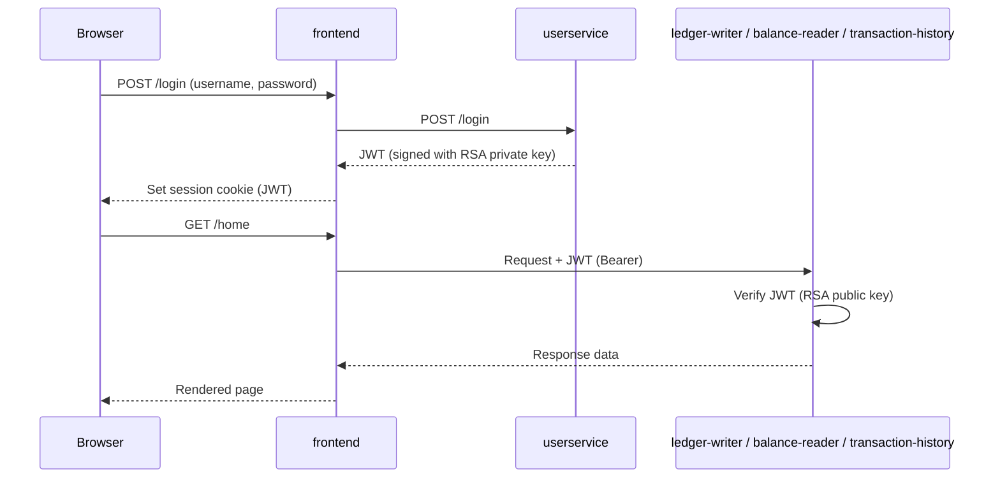
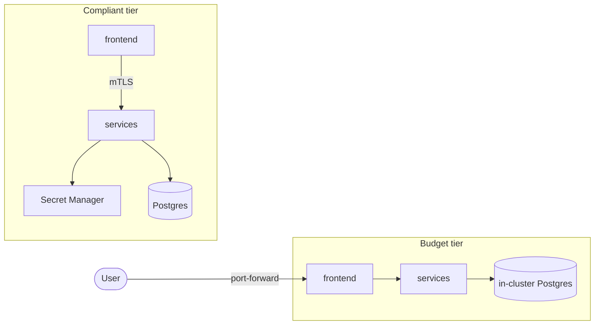

# Bank of Anthos — Architecture

## Service Diagram

## Authentication Flow

## Service Summary

| Service | Language | Port | Role |
|---|---|---|---|
| frontend | Python/Flask | 8080 | Web UI, BFF — fans out to all backend services |
| userservice | Python | 8080 | User registration, login, JWT signing |
| contacts | Python | 8080 | Manage linked external accounts per user |
| ledger-writer | Java/Spring | 8080 | Validate and write new transactions |
| balance-reader | Java/Spring | 8080 | Cached read of current account balances |
| transaction-history | Java/Spring | 8080 | Cached read of past transactions |
| accounts-db | PostgreSQL | 5432 | Stores user credentials and contact lists |
| ledger-db | PostgreSQL | 5432 | Immutable transaction ledger |
| loadgenerator | Python/Locust | — | Simulates user traffic for demos |

## Key Design Notes

- **Read/write separation**: `ledger-writer` handles all writes; `balance-reader` and `transaction-history` are independent read services that poll `ledger-db`.
- **Stateless auth**: `userservice` signs JWTs with an RSA private key. All other services verify them using the public key mounted from a shared Kubernetes Secret — no shared session store.
- **Multi-account support**: Each user may have one checking and one savings account (`accounts` table in `accounts-db`). The JWT `acct` claim identifies the active account; switching accounts re-issues the token via `POST /users/switch-account`. Internal transfers between a user's own accounts use the existing ledger payment flow (different from/to account numbers).
- **BFF pattern**: The `frontend` is the only service that calls other services. Backend services are all leaf nodes with no inter-service calls.
- **Kustomize overlays**: Each service has `base` manifests plus `development`, `staging`, `production`, and `production-fwi` overlays.

## Deployment Tiers

| Tier | Entry point | Credentials | Network | Typical use |
|------|-------------|-------------|---------|-------------|
| **Budget** | `kubectl apply -k kubernetes-manifests/overlays/budget/` | ConfigMaps (in-cluster Postgres) | Plain Kubernetes networking | Demos, trial credits, minimal GCP spend |
| **Compliant** | `kubectl apply -k kubernetes-manifests/` | Secret Manager + Workload Identity for `userservice` and `balancereader` | NetworkPolicy + Istio STRICT mTLS | Hardened single-cluster deployment |
| **Multi-env CI/CD** | Terraform in `iac/tf-multienv-cicd-anthos-autopilot/` | Secret Manager per environment | ASM + ACM fleet policies | Staging/production pipeline with Cloud SQL |

The budget overlay omits loadgenerator, external LoadBalancers, Istio, and Cloud Operations export. See [`docs/cost-optimized-deployment.md`](cost-optimized-deployment.md) for setup and teardown instructions.

